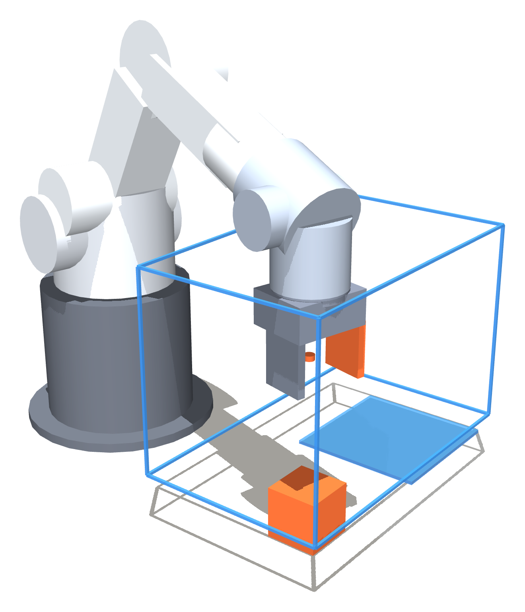
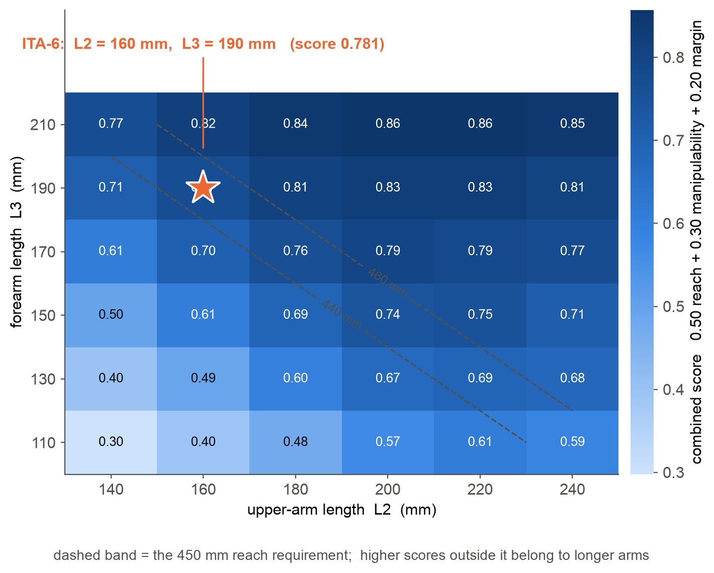
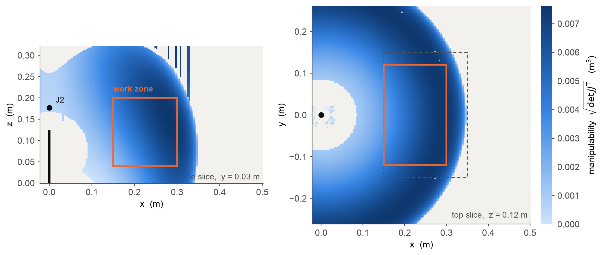

# ITA-6 — a 6-DOF arm designed by Caliper

ITA-6 is a 450 mm, 6-DOF spherical-wrist manipulator with a parallel-jaw
gripper. Its link lengths were not drawn and then checked; they are the winner
of a design sweep **scored by the Caliper engine itself** — reachability from
the closed-form 6R IK, manipulability from the singularity analysis, joint-limit
margin from the model's own limits, self-collision from `CollisionModel`, and
static payload torque from RNEA plus the engine's Jacobian.

The whole thing runs in **3 seconds** and writes its own URDF.



## The machine

| | |
|---|---|
| Kinematics | J1 yaw · J2 shoulder pitch · J3 elbow pitch · J4/J5/J6 spherical wrist (PUMA/OPW class) |
| Reach, base axis → TCP | **450 mm** (L2 160 + L3 190 + wrist offset 100) |
| Base height / shoulder offset | 125 mm / 52 mm |
| Joint limits | ±175° · ±120° · ±150° · ±175° · ±120° · ±180° |
| Actuators | NEMA17 + 30:1 strain wave at J1–J3 (12.0 N·m, 2.43 rad/s); NEMA14 + 20:1 planetary at J4/J5 (3.3 N·m); NEMA11 + 14:1 at J6 (0.95 N·m) |
| Gripper | prismatic `gripper` joint, jaw gap 36 → 76 mm, 60 N — grips a 40–50 mm cube |
| Mass | **3.24 kg total** = 2.03 kg moving + 1.22 kg pedestal |
| Payload | 1.0 kg structural (49 % of J2 torque), 0.5 kg precision (36 %) |

## How the design was produced

Everything below is in `design_ita6.py`; nothing is hand-tuned.

1. **Parametrize.** Upper-arm `L2`, forearm `L3` and base height `h_base` are
   free. The wrist offset (wrist centre → TCP, 100 mm) is fixed by the gripper
   stack, so reach = L2 + L3 + 100 mm.
2. **Emit a real URDF per candidate.** Link masses and full inertia tensors are
   composed analytically from a bill of materials — 6061 aluminium tube
   (2700 kg/m³), printed PLA-CF shells modelled as *actual hollow walls*
   (1240 kg/m³ of solid wall material, not a fudged density), steel shafts, and
   catalogue masses for every motor and gearbox. Each `<inertial>` is the
   parallel-axis sum of those primitives about the link COM, so it is physically
   valid by construction. Every `<collision>` is also the `<visual>`: the shape
   the doctor lints, the shape MuJoCo integrates and the shape in the render
   above are one object.
3. **Score over a work zone.** A 150 × 240 × 160 mm table-top box in front of
   the arm, 100 sampled points, tool held **vertical** and yawed radially at
   each one — the natural top-down pick approach. Per candidate:
   *reach fraction*, *manipulability index*, *joint-limit margin*. Unreachable
   samples count zero in the two quality indices, so the score is
   quality-weighted coverage rather than an average over whatever happened to
   work. Branch selection takes the **seed-nearest** limit-respecting closed-form
   solution — what a controller would actually command, not the most flattering
   branch.
4. **Rank.** `score = 0.50 · reach + 0.30 · manipulability + 0.20 · margin`,
   manipulability normalised by the best value in the grid (so the score ranks
   within this sweep; it is not an absolute). The winner is the best candidate
   **inside the 450 ± 10 mm reach band**.
5. **Refine** base height at the winning link lengths, then write `ita6.urdf`,
   `ita6_arm6.urdf` and `analysis.json`.



The optimum is an interior peak *along* the reach constraint, not a corner of
the grid — the six candidates that actually meet 450 mm rank:

| L2 (mm) | L3 (mm) | reach frac | manip index | margin | score |
|---:|---:|---:|---:|---:|---:|
| **160** | **190** | 0.98 | 0.00562 | 0.321 | **0.771** |
| 140 | 210 | 0.98 | 0.00567 | 0.297 | 0.768 |
| 180 | 170 | 0.98 | 0.00532 | 0.335 | 0.762 |
| 200 | 150 | 0.98 | 0.00478 | 0.338 | 0.742 |
| 220 | 130 | 0.94 | 0.00403 | 0.326 | 0.691 |
| 240 | 110 | 0.82 | 0.00313 | 0.287 | 0.588 |

Manipulability rewards a longer forearm (it keeps the elbow away from the
table); limit margin rewards a longer upper arm. 160/190 is where they cross.
Higher scores elsewhere on the grid belong to *longer arms* that fail the
450 mm requirement.

## Verified results for the winner

| Check | Result |
|---|---|
| `caliper doctor ita6.urdf` | **no findings** — 0 errors, 0 warnings, 0 infos |
| `caliper doctor ita6_arm6.urdf` | **no findings** |
| Work-zone reachability, tool vertical | **100 %** of 100 poses |
| Mean manipulability over the zone | **0.00556 m³** |
| Mean joint-limit margin | **0.333** (1.0 = dead centre of every range) |
| Self-collision over the zone | **0 of 100 poses** on the SHIPPED 7-DOF model (18 colliders incl. the jaw, checked at both gripper extremes), 0 uncovered frames |
| Twin agreement (arm6 vs full) | measured: the fixed tcp→jaw offset drifts ≤ 3.3e-16 across 50 random in-limit q — the 6R chains are identical |
| Analytic-IK residual (winner) | measured: max 2.6e-16 m over all 100 reached zone poses; **0 of 100 needed the micro-nudge** (the y=0 workaround never fires on the final geometry) |
| Static 1 kg payload | worst \|τ\| = 5.90 N·m (J2), 2.80 N·m (J3) — **within** the 12 N·m limits |
| Task in `VecSimEnv` | loads, steps, holds q0 to 0.00 mrad over 2 s |
| Design sweep runtime | **3.0 s** for 41 candidates × 100 IK poses |



## Files

| File | What it is |
|---|---|
| `design_ita6.py` | the entire design method; writes the two URDFs and `analysis.json` |
| `ita6.urdf` | **the arm** — 6R + `gripper` prismatic joint (7 DOF) |
| `ita6_arm6.urdf` | the bare 6R core; caliper's closed-form IK requires `ndof == 6`, and the first six joints are identical between the two files |
| `ita6.caliper-task.json` | pick-and-place task: 40 mm cube → drop zone, `placed_in_zone` success |
| `smoke_task.py` | loads the task, builds `VecSimEnv`, steps it |
| `make_figures.py` | the three poster figures |
| `analysis.json` | full sweep table, winner, payload check, doctor verdict, self-collision report |

## Reproduce

```sh
# the design sweep (writes ita6.urdf, ita6_arm6.urdf, analysis.json)
PATH=/usr/sbin:$PATH .venv/bin/python examples/ita6/design_ita6.py

# the task, through the full sim stack
MUJOCO_DYNAMIC_LINK_DIR=~/.cache/caliper/mujoco-3.9.0 \
  PATH=/usr/sbin:$PATH .venv/bin/python examples/ita6/smoke_task.py

# the figures
MUJOCO_DYNAMIC_LINK_DIR=~/.cache/caliper/mujoco-3.9.0 \
  PATH=/usr/sbin:$PATH .venv/bin/python examples/ita6/make_figures.py

# the doctor verdict, from the CLI
cargo build --release -p caliper-cli && ./target/release/caliper doctor examples/ita6/ita6.urdf
```

`/usr/sbin` on `PATH` is only needed because caliper's optional MuJoCo lane
shells out to `sysctl`. `make_figures.py` needs `matplotlib`.

## Honest limits

**This is a simulation-stage design.** Link lengths, mass properties, joint
limits and the actuator torque budget are settled and self-consistent; the
mechanical detailing is not. Bearing selection and preload, the strain-wave
mounting interfaces, belt routing and tensioning at J1/J3, cable management
through the wrist, fastener and tolerance stack-ups, thermal limits on the
steppers, and any manufacturing or assembly drawings are all future work. The
geometry is primitives (cylinders and boxes), which is enough to be
dynamically honest and collision-checkable but is not a CAD model.

Specific caveats, each of them measurable in `analysis.json`:

- **Moving mass is 2.03 kg**, above the 1.2–1.8 kg the brief hoped for. Two
  NEMA17s plus two strain-wave units are 0.86 kg of that on their own, so the
  actuator class sets the floor. Reaching 1.5 kg means a different drivetrain,
  not a lighter model of the same one.
- **The work zone is 150 × 240 × 160 mm, not the 200 × 300 × 200 mm** the brief
  first named. A 450 mm arm whose tool is 100 mm long keeps its wrist centre
  inside a 350 mm sphere, and a vertical tool spends all 100 mm going straight
  down; the larger box is simply outside the machine. The winner serves **76 %**
  of that larger box, and the script reports it.
- **The payload check covers tool-vertical poses only.** With the tool vertical
  the payload hangs on the wrist centre's own axis, so J1, J5 and J6 see no
  gravity load at all — the check exercises J2/J3, which is where the load is,
  but it is not a full-orientation torque envelope.
- **Self-collision is verified over the work zone, not the whole joint space.**
  Extreme wrist flexion (|q5| near the 120° stop) brings the wrist yoke back
  toward the forearm; real arms have the same restriction, but it is not swept
  here.
- The score's manipulability term is normalised by the best value *in this
  grid*, so scores compare candidates to each other and carry no absolute
  meaning.

## Known engine bug (found by building this)

`Robot.analytic_ik` returns an **empty branch list for reachable, in-limits
poses**. It is a knife-edge, not a region:

```python
r = caliper.Robot.from_urdf("oracle/fixtures/robots/showcase6.urdf")
q = [0.0, radians(30), radians(100.2), 0.0, radians(49.8), 0.0]
pose = r.fk(q)                                    # q is well inside every limit
r.analytic_ik(transpose(pose), seed=q)            # -> []  (should contain q)
```

Reproducible on the shipped `showcase6` fixture, so it is not specific to
ITA-6. It fires for **every** pose with y = 0 exactly — where the tool-down
target rotation is symmetric — while the same pose at y = 1e-12 solves fine,
and erratically for about 5 % of a dense slice elsewhere. Numeric `Robot.ik`
fails on the same poses too. `fk` of the hand-derived q lands on the target to
1e-16, so the configurations are real.

Two consequences here, both documented at the call site in `design_ita6.py`:

1. The work zone is sampled with an **even** number of points across y, so the
   grid straddles the symmetry plane instead of lying on it. Sampling the plane
   charged the bug to the robot: it read 80 % reachability instead of 100 %.
2. `solve_pose` retries a failed solve with the target displaced by a
   micrometre. That cannot change what the machine can reach at millimetre
   sample spacing, and caliper still verifies every branch it returns against
   the target.

The retries do not fully cover the folded-elbow region above z ≈ 0.34 m, where
the miss rate is much higher, so the workspace figure plots the working
envelope below it.
